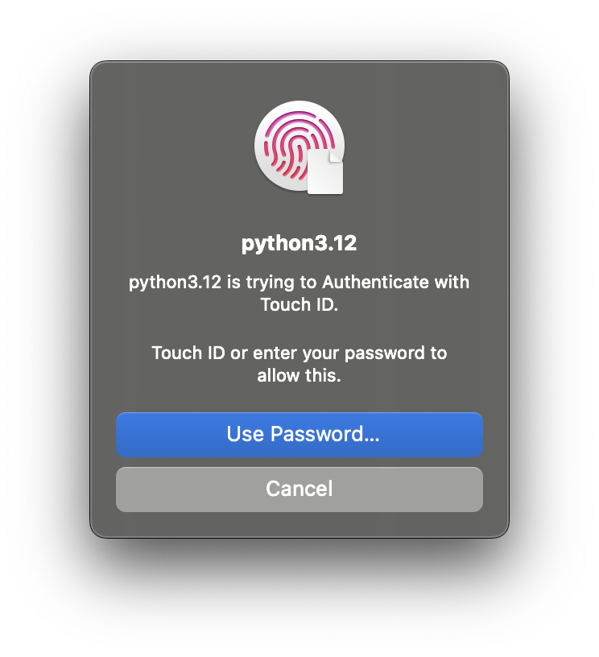

# Touch ID Authentication with Python

This script demonstrates how to use Touch ID authorization in a Python application on macOS using PyObjC.




## How it works

The script leverages the `LocalAuthentication` framework in macOS. It first checks if Touch ID is available and then presents an authentication dialog to the user.  The result of the authentication attempt (success or failure) is then printed to the console.

## How TouchID can be used

TouchID can only really be used to check the user is who is currently logged in to the computer. It is not possible to sign or encrypt something with TouchID. Apple Documentation talks about using Keyring which is encrypted but it is decrypted at login and as long as the user is active.

> The Secure Enclave then carries out the authentication by, for example, testing the user’s finger against the stored fingerprints. The Secure Enclave passes back a pass/fail result that gates keychain item access. No user space or operating system software ever has access to the underlying authentication data, such as stored fingerprints.
https://developer.apple.com/documentation/localauthentication/accessing-keychain-items-with-face-id-or-touch-id?language=objc


### Simple save and retrieve from Secure Keyring if that was what you wanted


```
security add-generic-password -a $USER -s "openai-api-key" -w "YOUR_OPENAI_API_KEY"
security find-generic-password -s "openai-api-key" -w
```

But this does not trigger TouchID, or can be instructed at all.

But you can make new keychain and make it lock after X min of inactivity which is cool.